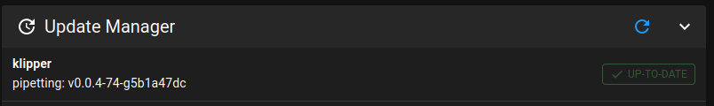

Welcome to my fork of the Klipper project, with awesome home-able extruders and CNC-style probing!

[](https://www.klipper3d.org/)

# General docs on Klipper

https://www.klipper3d.org/

Klipper is a 3d-Printer firmware. It combines the power of a general
purpose computer with one or more micro-controllers. See the
[features document](https://www.klipper3d.org/Features.html) for more information on why you should use Klipper.

To begin using Klipper start by [installing](https://www.klipper3d.org/Installation.html) it.

Klipper is Free Software. See the [license](COPYING) or read the [documentation](https://www.klipper3d.org/Overview.html). We depend on
the generous support from our [sponsors](https://www.klipper3d.org/Sponsors.html).

# Fork notes

This fork implements:

- Homing on the steppers of `[extruder]`s.
    - Module: [extruder_home.py](./klippy/extras/extruder_home.py)
    - Command: `HOME_EXTRUDER EXTRUDER=extruder`.
    - Caveats: `extruder` must be active (use [this](https://github.com/naikymen/klipper-homing-extruder/blob/pipetting/config/configs-pipetting-bot/config-pi-pico-mainsail/home_extruder.cfg#L21) macro for convenience). No "second home" is performed. It probably won't work on extruder steppers configured as `[extruder_stepper]` later synced to an `[extruder]`.
- Probing in arbitrary directions with `G38.2`, `G38.3`, `G38.4`, and `G38.5` (single-probe version).
    - Module: [probe_G38.py](./klippy/extras/probe_G38.py)
    - Example command: `G38.2 X20 F10`
    - For reference, see [LinuxCNC](http://linuxcnc.org/docs/stable/html/gcode/g-code.html#gcode:g38)'s definition of _G38.n Straight Probe_ commands.
    - Note: affected by `G90`/`G91` and `M82`/ `M83`.
    - Known incompatibilites: `[probe_G38_multi ...]`
- General probing with multiple probe pins is supported by an experimental module:
    - Module: [probe_G38_multi.py](./klippy/extras/probe_G38_multi.py)
    - Example multi-command: `MULTIPROBE2 PROBE_NAME=extruder1 Z=-20 F=1` (replace the `2` in `MULTIPROBE2` with `3`, `4`, or `5` for the other probing modes).
    - Example mono-command: `G38.2 X20 F10` (replace `.2` by `.3-.5` for the other probing modes). To choose the probe pin, this command will try to match the probe's config name to an extruder name, or fail.
    - Note: affected by `G90`/`G91` and `M82`/ `M83`.
    - Known incompatibilites: `[probe_G38]`
- The `SET_KINEMATIC_POSITION` command now works with extruder position as well.
    - Try this out: `SET_KINEMATIC_POSITION E=66.6`
- Absolute extruder moves are now absolute.
    - You can now count on absolute coordinate systems staying that way unless you update them explicitly (e.g. with `G92 E0` and similar commands).
    - The origin used to be altered without warning after every tool-change (i.e. extruder activation) in a way equivalent to sending `G92 E0`. This means that the extruder's origins were effectively relative to the last position of the extruder before a toolchange, which was enforced in Klipper to support the obscure expectations of old slicers.
    - See discussion at: https://klipper.discourse.group/t/6558

Rather minor modifications in Klippy's core were made to accommodate these features. This fork exists because a massive amount of effort is needed to merge new stuff into "main" Klipper. Fortunately this means that pull requests would be very welcome here, even for cool but half-baked features.

## Interested in CNC stuff for Klipper?

Let's chat over here: https://klipper.discourse.group/t/klipper-forks-for-cnc/5698

Cheers!

## Configs

See examples here: [config-pi-pico-mainsail](./config/configs-pipetting-bot/config-pi-pico-mainsail)

These are meant as reference configs; you _must_ adjust them to match your setup first.

### Extruder homing config

Main config: [printer.cfg](./config/configs-pipetting-bot/configs-mainsail/labo-robot-pinmap/printer.cfg)

At a glance:

```yaml
[extruder]
# ...
# ...
# Setup all the usual extruder parameters before these:
position_endstop: 0.0
position_min: 0.0
position_max: 100.0
homing_speed: 25.0
second_homing_speed: 25.0
homing_retract_speed: 25.0
homing_retract_dist: 2.0
homing_positive_dir: False  # ADJUST TO MATCH YOUR SETUP
endstop_pin: gpio15  # REPLACE WITH THE PIN OF **YOUR** HOMING ENDSTOP

[extruder_home extruder]
# No parameters needed.

[extruder1]
# ...
# ...
# Setup all the usual extruder parameters before these.
position_endstop: 0.0
position_min: 0.0
position_max: 100.0
homing_speed: 25.0
second_homing_speed: 25.0
homing_retract_speed: 25.0
homing_retract_dist: 2.0
homing_positive_dir: False  # ADJUST TO MATCH YOUR SETUP
endstop_pin: gpio18  # REPLACE WITH THE PIN OF **YOUR** HOMING ENDSTOP

[extruder_home extruder1]
# No parameters needed.
```

### Single-probe config

Config: [probe_G38.cfg](./config/configs-pipetting-bot/configs-mainsail/labo-robot-pinmap/probe_G38.cfg)

```yaml
[probe_G38]
recovery_time: 0.4
pin: gpio19
z_offset: 0
```

### Multi-probing config

Config: [probe_G38_multi.cfg](./config/configs-pipetting-bot/configs-mainsail/labo-robot-pinmap/probe_G38_multi.cfg)

```yaml
[probe_G38_multi extruder]
recovery_time: 0.0
pin: ^tools:PC5
z_offset: 0


[probe_G38_multi extruder1]
recovery_time: 0.0
pin: ^tools:PB1
z_offset: 0
```

# Use cases

- General CNC usage.
- Syringe extruders.
- Pipetting / liquid-handling robots.

# Installation

The easiest way is to use a KIAUH "klipper_repos.txt" file. Details at: https://github.com/th33xitus/kiauh/blob/master/klipper_repos.txt.example

1. SSH into the Pi.
2. Copy "klipper_repos.txt.example" to "klipper_repos.txt".
    - Use the command: `cp kiauh/klipper_repos.txt.example  kiauh/klipper_repos.txt`
4. Edit the `kiauh/klipper_repos.txt` file to append "`naikymen/klipper-homing-extruder,pipetting`" after the last line.
    - Use the command: `echo "naikymen/klipper-homing-extruder,pipetting" >> kiauh/klipper_repos.txt`
5. Start KIAUH.
    - Use the command: `./kiauh/kiauh.sh`
7. Choose option "`6) [Settings]`".
8. Choose option "`1) Set custom Klipper repository`".
9. Choose the option corresonding to "`naikymen/klipper-homing-extruder -> pipetting`"
10. Use KIAUH to uninstall and reinstall Klipper.

## Updates through moonraker

Unfortunately the differing repo and branch names dont play well with the hard-coded stuff in Moonraker.

However by applying this simple diff to `~/moonraker` it will just work:

```diff
diff --git a/moonraker/components/simplyprint.py b/moonraker/components/simplyprint.py
index a3bfac3..ba33057 100644
--- a/moonraker/components/simplyprint.py
+++ b/moonraker/components/simplyprint.py
@@ -1002,7 +1002,8 @@ class SimplyPrint(Subscribable):
             "firmware": "Klipper",
             "firmware_version": version,
             "firmware_date": firmware_date,
-            "firmware_link": "https://github.com/Klipper3d/klipper",
+            # "firmware_link": "https://github.com/Klipper3d/klipper",
+            "firmware_link": "https://github.com/naikymen/klipper-homing-extruder",
         }
         diff = self._get_object_diff(fw_info, self.cache.firmware_info)
         if diff:
diff --git a/moonraker/components/update_manager/base_config.py b/moonraker/components/update_manager/base_config.py
index 4bcccbc..7c48aef 100644
--- a/moonraker/components/update_manager/base_config.py
+++ b/moonraker/components/update_manager/base_config.py
@@ -34,7 +34,9 @@ BASE_CONFIG: Dict[str, Dict[str, str]] = {
     },
     "klipper": {
         "moved_origin": "https://github.com/kevinoconnor/klipper.git",
-        "origin": "https://github.com/Klipper3d/klipper.git",
+        # "origin": "https://github.com/Klipper3d/klipper.git",
+        "origin": "https://github.com/naikymen/klipper-homing-extruder.git",
+        "primary_branch": "pipetting",
         "requirements": "scripts/klippy-requirements.txt",
         "venv_args": "-p python2",
         "install_script": "scripts/install-octopi.sh",
```



Since this modifies the Moonraker source, now Moonraker won't be updatable because it will have diverged and thus "invalid" or "dirty" (rawr?).


A price I am willing to pay (?)

Raise your hand here to change this: https://github.com/Arksine/moonraker/issues/615

