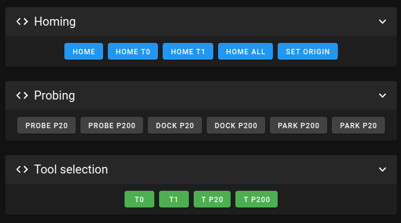

# Configuration for the Pipetting-bot

All Klipper configuration files for the robot at the "lab" are backed-up to this directory. These should be considered the "latest" configs.

The only missing customization are the macro groups in Mainsail, which come in handy during tool-change calibration.

